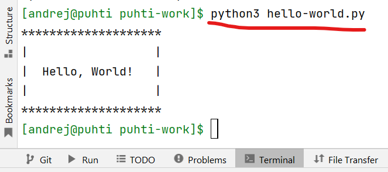

# Demo on using computing resources at Puhti

## Get IDE

Apply and register with your Arcada email at  https://www.jetbrains.com/community/education/#students

Download PyCharm Professional https://www.jetbrains.com/pycharm/download/

Fire up PyCharm and activate your student license.

Clone this repo from https://github.com/arcada-uas/using-puhti-demo.git


Add new SSH configuration with your CSC credentials and Test Connection.


Open a new Terminal and start SSH session


~~In the Puhti terminal create a new directory if not exist and make it `cwd`~~

```
~~mkdir -p ~/puhti-work; cd ~/puhti-work~~
```
Export variable PROJ with project number for your convenience.

```
export PROJ=2000859
```
Export variable YEAR with project number for your convenience.

```
export YEAR=2023
```

Make this your cwd
```
cd /projappl/project_$PROJ/BDA$YEAR
```

Now create a folder for you if not exists, change cwd and get study material from github
```
mkdir -p $USER
cd $USER
git clone https://github.com/arcada-uas/using-puhti-demo.git
cd using-puhti-demo
ls -lh
```

Create sym links to the project's scratch disk for your convenience.
```
ln -s /scratch/project_$PROJ/BDA$YEAR /projappl/project_$PROJ/BDA$YEAR/$USER/scratch
```

Open Tools > Deployment > Configuration... and create a new one. 
Then choose Browse Remote Host.


At Mappings insert _slash_ as Deployment path.


At top right you should see something like this.


You can check the size of data directory:

    du -sh scratch_$PROJ/dogs-vs-cats


Open `hello-world.py` script file and from contextual menu choose Upload to ...


At Puhti terminal run 
```
`   python3 hello-world.py `
```
and get this



## Documentation

Now it is time to read documentation https://docs.csc.fi/computing/running/getting-started/ 

After reading, you can test run the first bach job. Open file `run-hw.sh` 
and add the billing project information (`account=...`).

You will use module `python-data/3.9-2` for the test. 
Read more https://docs.csc.fi/apps/#data-analytics-and-machine-learning

In the Puhti terminal run 

```
    sbatch  run-hw.sh  hello-world.py
    tail -f slurm-NNNNNNNN.out
```


You are reading the end of the output file while it's being written. 
Exit `tail` with CTRL-C

After the job has finished, check the batch job's runtime and resource utilization using `seff <jobID>`
```
  seff NNNNNNN
```
It's not always easy to estimate the resorses needed. Read the recomendatons https://docs.csc.fi/support/faq/how-much-memory-my-job-needs/ 
and run some tests on part of your data.


## TF2/Keras - Image classification: dogs vs. cats

* *tf2-dvc-cnn-simple.py*: Dogs vs. cats with a CNN trained from scratch
* *tf2-dvc-cnn-evaluate.py*: Evaluate a trained CNN with test data
* *tf2-dvc-cnn-predict.py*: Use trained CNN to predict the class label of supplied jpg file

To train a simple CNN from scratch:

    sbatch   run-tf2.sh   tf2-dvc-cnn-simple.py

To evaluate trained model on the test set, append models file name as a command line argument, e.g.

    sbatch   run-tf2.sh   tf2-dvc-cnn-evaluate.py   dvc-cnn-simple.h5

To predict the class label of a jpg file, append models file name and jpg file name as command line arguments, e.g.

    sbatch   run-tf2.sh  tf2-dvc-cnn-predict.py   dvc-cnn-simple.h5    dogs-vs-cats/train-2000/validation/cats/cat.12001.jpg

